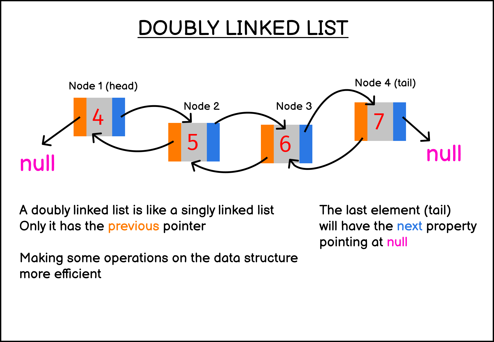

# This project creates, and performs various Double LinkedList operations in JavaScript.

## What is a doubly LinkedList?
A linked list is a linear collection of data elements whose order is not given by their physical placement in memory. Instead, each element points to the next. It is a data structure consisting of a collection of nodes which together represent a sequence. 

Links referred: A doubly linked list (sometimes also called double linked list) is a type of linked list data structure that has two references in each node:

> The next reference that points to the next node
> The previous reference that points to the previous node

Links referred: https://sebhastian.com/doubly-linked-list-javascript/